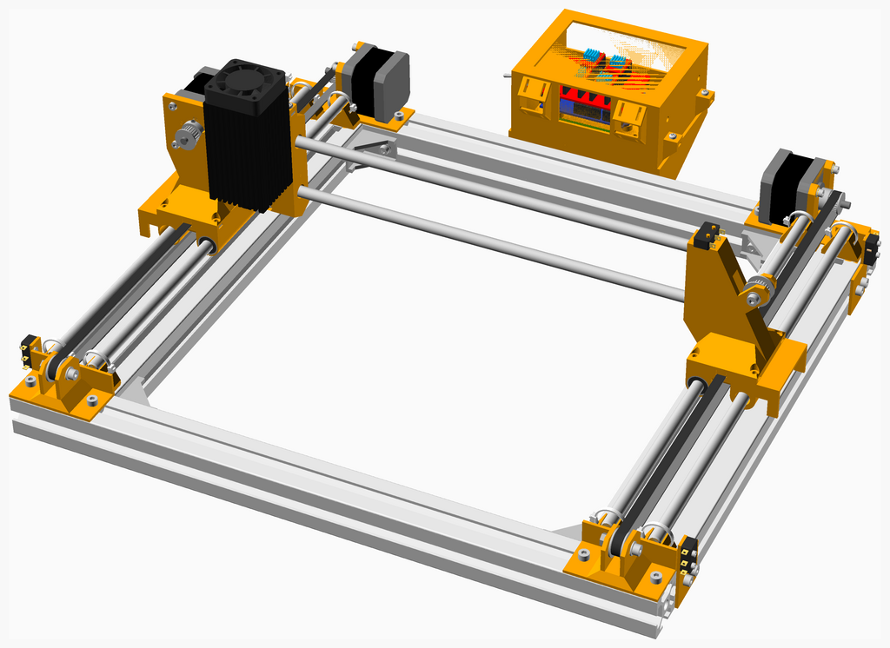

# Fisher Price CNC

---
## Table of Contents
1. [Parts list](#Parts_list)
1. [Y Axis Holder Assembly](#y_axis_holder_assembly)
1. [Y Rod Assembly](#y_rod_assembly)
1. [Frame Assembly](#frame_assembly)
1. [Main Assembly](#main_assembly)

[Top](#TOP)

---

## Parts list
| Y&nbsp;Axis&nbsp;Holder | Y&nbsp;Rod | Frame | Main | TOTALS |  |
|---:|---:|---:|---:|---:|:---|
|  |  |  |  | | **Vitamins** |
| &nbsp;&nbsp;.&nbsp; | &nbsp;&nbsp;.&nbsp; | &nbsp;&nbsp;2&nbsp; | &nbsp;&nbsp;.&nbsp; |  &nbsp;&nbsp;2&nbsp; | &nbsp;&nbsp; Extrusion E3030 x 435mm |
| &nbsp;&nbsp;.&nbsp; | &nbsp;&nbsp;.&nbsp; | &nbsp;&nbsp;2&nbsp; | &nbsp;&nbsp;.&nbsp; |  &nbsp;&nbsp;2&nbsp; | &nbsp;&nbsp; Extrusion E3060 x 335mm |
| &nbsp;&nbsp;.&nbsp; | &nbsp;&nbsp;.&nbsp; | &nbsp;&nbsp;4&nbsp; | &nbsp;&nbsp;.&nbsp; |  &nbsp;&nbsp;4&nbsp; | &nbsp;&nbsp; Extrusion corner bracket 20 |
| &nbsp;&nbsp;8&nbsp; | &nbsp;&nbsp;.&nbsp; | &nbsp;&nbsp;8&nbsp; | &nbsp;&nbsp;.&nbsp; |  &nbsp;&nbsp;16&nbsp; | &nbsp;&nbsp; Nut M4 sliding T |
| &nbsp;&nbsp;.&nbsp; | &nbsp;&nbsp;.&nbsp; | &nbsp;&nbsp;8&nbsp; | &nbsp;&nbsp;.&nbsp; |  &nbsp;&nbsp;8&nbsp; | &nbsp;&nbsp; Screw M4 cap x  8mm |
| &nbsp;&nbsp;8&nbsp; | &nbsp;&nbsp;.&nbsp; | &nbsp;&nbsp;.&nbsp; | &nbsp;&nbsp;.&nbsp; |  &nbsp;&nbsp;8&nbsp; | &nbsp;&nbsp; Screw M4 cap x 10mm |
| &nbsp;&nbsp;8&nbsp; | &nbsp;&nbsp;.&nbsp; | &nbsp;&nbsp;.&nbsp; | &nbsp;&nbsp;.&nbsp; |  &nbsp;&nbsp;8&nbsp; | &nbsp;&nbsp; Smooth rod 8mm x 30mm |
| &nbsp;&nbsp;.&nbsp; | &nbsp;&nbsp;4&nbsp; | &nbsp;&nbsp;.&nbsp; | &nbsp;&nbsp;.&nbsp; |  &nbsp;&nbsp;4&nbsp; | &nbsp;&nbsp; Smooth rod 8mm x 335mm |
| &nbsp;&nbsp;.&nbsp; | &nbsp;&nbsp;.&nbsp; | &nbsp;&nbsp;8&nbsp; | &nbsp;&nbsp;.&nbsp; |  &nbsp;&nbsp;8&nbsp; | &nbsp;&nbsp; Washer  M4 x 9mm x 0.8mm |
| &nbsp;&nbsp;8&nbsp; | &nbsp;&nbsp;.&nbsp; | &nbsp;&nbsp;.&nbsp; | &nbsp;&nbsp;.&nbsp; |  &nbsp;&nbsp;8&nbsp; | &nbsp;&nbsp; Ziptie 2.5mm x 100mm min length |
| &nbsp;&nbsp;32&nbsp; | &nbsp;&nbsp;4&nbsp; | &nbsp;&nbsp;32&nbsp; | &nbsp;&nbsp;.&nbsp; | &nbsp;&nbsp;68&nbsp; | &nbsp;&nbsp;Total vitamins count |
|  |  |  |  | | **3D printed parts** |
| &nbsp;&nbsp;8&nbsp; | &nbsp;&nbsp;.&nbsp; | &nbsp;&nbsp;.&nbsp; | &nbsp;&nbsp;.&nbsp; |  &nbsp;&nbsp;8&nbsp; | &nbsp;&nbsp;y_axis_holder.stl |
| &nbsp;&nbsp;8&nbsp; | &nbsp;&nbsp;.&nbsp; | &nbsp;&nbsp;.&nbsp; | &nbsp;&nbsp;.&nbsp; | &nbsp;&nbsp;8&nbsp; | &nbsp;&nbsp;Total 3D printed parts count |

[Top](#TOP)

---

## 8 x Y Axis Holder Assembly
### Vitamins
|Qty|Description|
|---:|:----------|
|8| Nut M4 sliding T|
|8| Screw M4 cap x 10mm|
|8| Smooth rod 8mm x 30mm|
|8| Ziptie 2.5mm x 100mm min length|

### 3D Printed parts

| 8 x y_axis_holder.stl |
|---|
|  

### Assembly instructions

[Top](#TOP)

---

## 4 x Y Rod Assembly
### Vitamins
|Qty|Description|
|---:|:----------|
|4| Smooth rod 8mm x 335mm|

### Sub-assemblies

| 8 x y_axis_holder_assembly |
|---|
|  

### Assembly instructions

[Top](#TOP)

---

## Frame Assembly
### Vitamins
|Qty|Description|
|---:|:----------|
|2| Extrusion E3030 x 435mm|
|2| Extrusion E3060 x 335mm|
|4| Extrusion corner bracket 20|
|8| Nut M4 sliding T|
|8| Screw M4 cap x  8mm|
|8| Washer  M4 x 9mm x 0.8mm|

### Assembly instructions

[Top](#TOP)

---

## Main Assembly
### Sub-assemblies

| 1 x frame_assembly | 4 x y_rod_assembly |
|---|---|
|  |  

### Assembly instructions

* Assembles the CNC. ALL T-nuts must be inserted prior to assembling the
* frame with the corner brackets.

[Top](#TOP)
