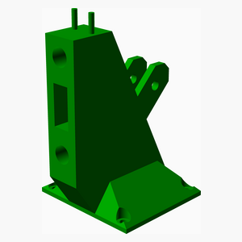
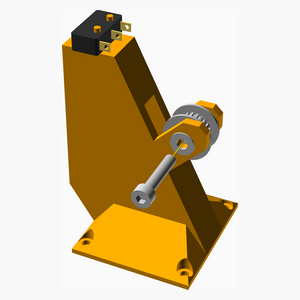
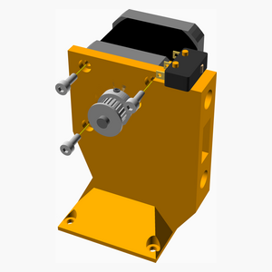
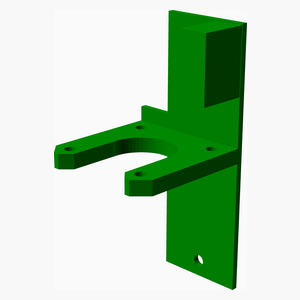
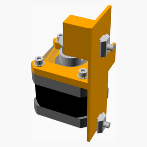
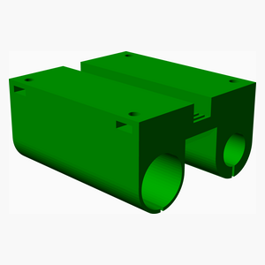
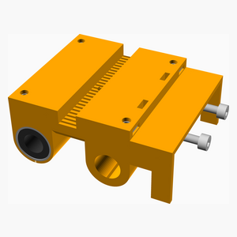
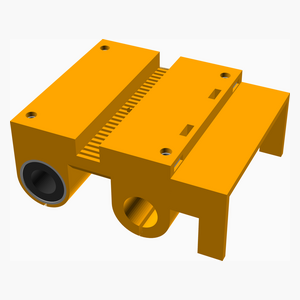

# Fisher Price CNC
Fisher Price CNC is a project to turn some parts from the world's worst 3D printer
into a reasonable CNC machine (probably a laser engraver of sorts).

Mechanical parts can be printed out of PLA for testing and PETG for production use.

List of purchases:
* Arduino + GRBL shield + motor drivers: https://smile.amazon.co.uk/gp/product/B06XJKVLG3/
* Belts: https://smile.amazon.co.uk/gp/product/B07JGXG7S2/
* Cap (hex) screws (M2/M3/M4): https://smile.amazon.co.uk/gp/product/B07KCT2F6K/
* M3 square nuts: https://smile.amazon.co.uk/gp/product/B075YSD5TN/
* Pan (phillips) screws (M3): https://smile.amazon.co.uk/gp/product/B07FTDRZRZ/
* LM8UU linear bearings: https://www.ebay.co.uk/itm/LM8UU-8mm-Linear-Bearing-for-Precision-shafts-3D-Printer-CNC-machine/124087391637

If you do not have a Monoprice Mini Delta, you will also need to buy:
* 6x 345x8mm smooth rods, preferably steel
* 3x NEMA17 stepper motors

---
## Table of Contents
1. [Parts list](#Parts_list)
1. [X Idler Assembly](#x_idler_assembly)
1. [X Motor And Pulley Assembly](#x_motor_and_pulley_assembly)
1. [X Motor Holder Assembly](#x_motor_holder_assembly)
1. [X Axis Assembly](#x_axis_assembly)
1. [Y Motor Right Assembly](#y_motor_right_assembly)
1. [Y Motor Left Assembly](#y_motor_left_assembly)
1. [Back Assembly](#back_assembly)
1. [Y Idler Assembly](#y_idler_assembly)
1. [Front Assembly](#front_assembly)
1. [Y Carriage Base Assembly](#y_carriage_base_assembly)
1. [Y Limit Switch Assembly](#y_limit_switch_assembly)
1. [Y Axis Holder Assembly](#y_axis_holder_assembly)
1. [Y Axis Assembly](#y_axis_assembly)
1. [Main Assembly](#main_assembly)

[Top](#TOP)

---

## Parts list
| X&nbsp;Idler | X&nbsp;Motor&nbsp;And&nbsp;Pulley | X&nbsp;Motor&nbsp;Holder | X&nbsp;Axis | Y&nbsp;Motor&nbsp;Right | Y&nbsp;Motor&nbsp;Left | Back | Y&nbsp;Idler | Front | Y&nbsp;Carriage&nbsp;Base | Y&nbsp;Limit&nbsp;Switch | Y&nbsp;Axis&nbsp;Holder | Y&nbsp;Axis | Main | TOTALS |  |
|---:|---:|---:|---:|---:|---:|---:|---:|---:|---:|---:|---:|---:|---:|---:|:---|
|  |  |  |  |  |  |  |  |  |  |  |  |  |  | | **Vitamins** |
| &nbsp;&nbsp;.&nbsp; | &nbsp;&nbsp;.&nbsp; | &nbsp;&nbsp;.&nbsp; | &nbsp;&nbsp;.&nbsp; | &nbsp;&nbsp;.&nbsp; | &nbsp;&nbsp;.&nbsp; | &nbsp;&nbsp;.&nbsp; | &nbsp;&nbsp;.&nbsp; | &nbsp;&nbsp;.&nbsp; | &nbsp;&nbsp;.&nbsp; | &nbsp;&nbsp;.&nbsp; | &nbsp;&nbsp;.&nbsp; | &nbsp;&nbsp;.&nbsp; | &nbsp;&nbsp;2&nbsp; |  &nbsp;&nbsp;2&nbsp; | &nbsp;&nbsp; Belt GT2 x 6mm x 814mm |
| &nbsp;&nbsp;.&nbsp; | &nbsp;&nbsp;.&nbsp; | &nbsp;&nbsp;.&nbsp; | &nbsp;&nbsp;.&nbsp; | &nbsp;&nbsp;.&nbsp; | &nbsp;&nbsp;.&nbsp; | &nbsp;&nbsp;1&nbsp; | &nbsp;&nbsp;.&nbsp; | &nbsp;&nbsp;1&nbsp; | &nbsp;&nbsp;.&nbsp; | &nbsp;&nbsp;.&nbsp; | &nbsp;&nbsp;.&nbsp; | &nbsp;&nbsp;.&nbsp; | &nbsp;&nbsp;.&nbsp; |  &nbsp;&nbsp;2&nbsp; | &nbsp;&nbsp; Extrusion E3030 x 445mm |
| &nbsp;&nbsp;.&nbsp; | &nbsp;&nbsp;.&nbsp; | &nbsp;&nbsp;.&nbsp; | &nbsp;&nbsp;.&nbsp; | &nbsp;&nbsp;.&nbsp; | &nbsp;&nbsp;.&nbsp; | &nbsp;&nbsp;.&nbsp; | &nbsp;&nbsp;.&nbsp; | &nbsp;&nbsp;.&nbsp; | &nbsp;&nbsp;.&nbsp; | &nbsp;&nbsp;.&nbsp; | &nbsp;&nbsp;.&nbsp; | &nbsp;&nbsp;2&nbsp; | &nbsp;&nbsp;.&nbsp; |  &nbsp;&nbsp;2&nbsp; | &nbsp;&nbsp; Extrusion E3060 x 345mm |
| &nbsp;&nbsp;.&nbsp; | &nbsp;&nbsp;.&nbsp; | &nbsp;&nbsp;.&nbsp; | &nbsp;&nbsp;.&nbsp; | &nbsp;&nbsp;.&nbsp; | &nbsp;&nbsp;.&nbsp; | &nbsp;&nbsp;.&nbsp; | &nbsp;&nbsp;.&nbsp; | &nbsp;&nbsp;.&nbsp; | &nbsp;&nbsp;.&nbsp; | &nbsp;&nbsp;.&nbsp; | &nbsp;&nbsp;.&nbsp; | &nbsp;&nbsp;.&nbsp; | &nbsp;&nbsp;4&nbsp; |  &nbsp;&nbsp;4&nbsp; | &nbsp;&nbsp; Extrusion corner bracket 20 |
| &nbsp;&nbsp;.&nbsp; | &nbsp;&nbsp;.&nbsp; | &nbsp;&nbsp;.&nbsp; | &nbsp;&nbsp;.&nbsp; | &nbsp;&nbsp;.&nbsp; | &nbsp;&nbsp;.&nbsp; | &nbsp;&nbsp;.&nbsp; | &nbsp;&nbsp;.&nbsp; | &nbsp;&nbsp;.&nbsp; | &nbsp;&nbsp;6&nbsp; | &nbsp;&nbsp;.&nbsp; | &nbsp;&nbsp;.&nbsp; | &nbsp;&nbsp;.&nbsp; | &nbsp;&nbsp;.&nbsp; |  &nbsp;&nbsp;6&nbsp; | &nbsp;&nbsp; Linear bearing LM8UU |
| &nbsp;&nbsp;.&nbsp; | &nbsp;&nbsp;.&nbsp; | &nbsp;&nbsp;.&nbsp; | &nbsp;&nbsp;.&nbsp; | &nbsp;&nbsp;.&nbsp; | &nbsp;&nbsp;.&nbsp; | &nbsp;&nbsp;.&nbsp; | &nbsp;&nbsp;.&nbsp; | &nbsp;&nbsp;.&nbsp; | &nbsp;&nbsp;.&nbsp; | &nbsp;&nbsp;4&nbsp; | &nbsp;&nbsp;.&nbsp; | &nbsp;&nbsp;.&nbsp; | &nbsp;&nbsp;.&nbsp; |  &nbsp;&nbsp;4&nbsp; | &nbsp;&nbsp; Microswitch SS-01 or SS-5GL |
| &nbsp;&nbsp;.&nbsp; | &nbsp;&nbsp;.&nbsp; | &nbsp;&nbsp;.&nbsp; | &nbsp;&nbsp;.&nbsp; | &nbsp;&nbsp;.&nbsp; | &nbsp;&nbsp;.&nbsp; | &nbsp;&nbsp;.&nbsp; | &nbsp;&nbsp;.&nbsp; | &nbsp;&nbsp;.&nbsp; | &nbsp;&nbsp;.&nbsp; | &nbsp;&nbsp;8&nbsp; | &nbsp;&nbsp;.&nbsp; | &nbsp;&nbsp;.&nbsp; | &nbsp;&nbsp;.&nbsp; |  &nbsp;&nbsp;8&nbsp; | &nbsp;&nbsp; Nut M2 x 1.6mm  |
| &nbsp;&nbsp;.&nbsp; | &nbsp;&nbsp;.&nbsp; | &nbsp;&nbsp;.&nbsp; | &nbsp;&nbsp;.&nbsp; | &nbsp;&nbsp;.&nbsp; | &nbsp;&nbsp;.&nbsp; | &nbsp;&nbsp;.&nbsp; | &nbsp;&nbsp;.&nbsp; | &nbsp;&nbsp;.&nbsp; | &nbsp;&nbsp;2&nbsp; | &nbsp;&nbsp;.&nbsp; | &nbsp;&nbsp;.&nbsp; | &nbsp;&nbsp;.&nbsp; | &nbsp;&nbsp;.&nbsp; |  &nbsp;&nbsp;2&nbsp; | &nbsp;&nbsp; Nut M3 x 2.4mm  |
| &nbsp;&nbsp;.&nbsp; | &nbsp;&nbsp;.&nbsp; | &nbsp;&nbsp;.&nbsp; | &nbsp;&nbsp;.&nbsp; | &nbsp;&nbsp;.&nbsp; | &nbsp;&nbsp;.&nbsp; | &nbsp;&nbsp;.&nbsp; | &nbsp;&nbsp;.&nbsp; | &nbsp;&nbsp;.&nbsp; | &nbsp;&nbsp;12&nbsp; | &nbsp;&nbsp;.&nbsp; | &nbsp;&nbsp;.&nbsp; | &nbsp;&nbsp;.&nbsp; | &nbsp;&nbsp;.&nbsp; |  &nbsp;&nbsp;12&nbsp; | &nbsp;&nbsp; Nut M3nS 5.5 x 1.8mm  |
| &nbsp;&nbsp;.&nbsp; | &nbsp;&nbsp;.&nbsp; | &nbsp;&nbsp;.&nbsp; | &nbsp;&nbsp;.&nbsp; | &nbsp;&nbsp;.&nbsp; | &nbsp;&nbsp;.&nbsp; | &nbsp;&nbsp;.&nbsp; | &nbsp;&nbsp;.&nbsp; | &nbsp;&nbsp;.&nbsp; | &nbsp;&nbsp;.&nbsp; | &nbsp;&nbsp;8&nbsp; | &nbsp;&nbsp;.&nbsp; | &nbsp;&nbsp;.&nbsp; | &nbsp;&nbsp;.&nbsp; |  &nbsp;&nbsp;8&nbsp; | &nbsp;&nbsp; Nut M4 hammer |
| &nbsp;&nbsp;.&nbsp; | &nbsp;&nbsp;.&nbsp; | &nbsp;&nbsp;.&nbsp; | &nbsp;&nbsp;.&nbsp; | &nbsp;&nbsp;2&nbsp; | &nbsp;&nbsp;2&nbsp; | &nbsp;&nbsp;.&nbsp; | &nbsp;&nbsp;4&nbsp; | &nbsp;&nbsp;.&nbsp; | &nbsp;&nbsp;.&nbsp; | &nbsp;&nbsp;.&nbsp; | &nbsp;&nbsp;8&nbsp; | &nbsp;&nbsp;.&nbsp; | &nbsp;&nbsp;8&nbsp; |  &nbsp;&nbsp;24&nbsp; | &nbsp;&nbsp; Nut M4 sliding T |
| &nbsp;&nbsp;1&nbsp; | &nbsp;&nbsp;.&nbsp; | &nbsp;&nbsp;.&nbsp; | &nbsp;&nbsp;.&nbsp; | &nbsp;&nbsp;.&nbsp; | &nbsp;&nbsp;.&nbsp; | &nbsp;&nbsp;.&nbsp; | &nbsp;&nbsp;2&nbsp; | &nbsp;&nbsp;.&nbsp; | &nbsp;&nbsp;.&nbsp; | &nbsp;&nbsp;.&nbsp; | &nbsp;&nbsp;.&nbsp; | &nbsp;&nbsp;.&nbsp; | &nbsp;&nbsp;.&nbsp; |  &nbsp;&nbsp;3&nbsp; | &nbsp;&nbsp; Nut M4 x 3.2mm  |
| &nbsp;&nbsp;1&nbsp; | &nbsp;&nbsp;.&nbsp; | &nbsp;&nbsp;.&nbsp; | &nbsp;&nbsp;.&nbsp; | &nbsp;&nbsp;.&nbsp; | &nbsp;&nbsp;.&nbsp; | &nbsp;&nbsp;.&nbsp; | &nbsp;&nbsp;2&nbsp; | &nbsp;&nbsp;.&nbsp; | &nbsp;&nbsp;.&nbsp; | &nbsp;&nbsp;.&nbsp; | &nbsp;&nbsp;.&nbsp; | &nbsp;&nbsp;.&nbsp; | &nbsp;&nbsp;.&nbsp; |  &nbsp;&nbsp;3&nbsp; | &nbsp;&nbsp; Pulley GT2 idler 20 teeth |
| &nbsp;&nbsp;.&nbsp; | &nbsp;&nbsp;1&nbsp; | &nbsp;&nbsp;.&nbsp; | &nbsp;&nbsp;.&nbsp; | &nbsp;&nbsp;1&nbsp; | &nbsp;&nbsp;1&nbsp; | &nbsp;&nbsp;.&nbsp; | &nbsp;&nbsp;.&nbsp; | &nbsp;&nbsp;.&nbsp; | &nbsp;&nbsp;.&nbsp; | &nbsp;&nbsp;.&nbsp; | &nbsp;&nbsp;.&nbsp; | &nbsp;&nbsp;.&nbsp; | &nbsp;&nbsp;.&nbsp; |  &nbsp;&nbsp;3&nbsp; | &nbsp;&nbsp; Pulley GT2OB 20 teeth |
| &nbsp;&nbsp;.&nbsp; | &nbsp;&nbsp;.&nbsp; | &nbsp;&nbsp;.&nbsp; | &nbsp;&nbsp;.&nbsp; | &nbsp;&nbsp;.&nbsp; | &nbsp;&nbsp;.&nbsp; | &nbsp;&nbsp;.&nbsp; | &nbsp;&nbsp;.&nbsp; | &nbsp;&nbsp;.&nbsp; | &nbsp;&nbsp;.&nbsp; | &nbsp;&nbsp;8&nbsp; | &nbsp;&nbsp;.&nbsp; | &nbsp;&nbsp;.&nbsp; | &nbsp;&nbsp;.&nbsp; |  &nbsp;&nbsp;8&nbsp; | &nbsp;&nbsp; Screw M2 cap x 10mm |
| &nbsp;&nbsp;.&nbsp; | &nbsp;&nbsp;.&nbsp; | &nbsp;&nbsp;.&nbsp; | &nbsp;&nbsp;.&nbsp; | &nbsp;&nbsp;.&nbsp; | &nbsp;&nbsp;.&nbsp; | &nbsp;&nbsp;.&nbsp; | &nbsp;&nbsp;.&nbsp; | &nbsp;&nbsp;.&nbsp; | &nbsp;&nbsp;4&nbsp; | &nbsp;&nbsp;.&nbsp; | &nbsp;&nbsp;.&nbsp; | &nbsp;&nbsp;.&nbsp; | &nbsp;&nbsp;.&nbsp; |  &nbsp;&nbsp;4&nbsp; | &nbsp;&nbsp; Screw M3 cap x  6mm |
| &nbsp;&nbsp;.&nbsp; | &nbsp;&nbsp;.&nbsp; | &nbsp;&nbsp;3&nbsp; | &nbsp;&nbsp;.&nbsp; | &nbsp;&nbsp;4&nbsp; | &nbsp;&nbsp;4&nbsp; | &nbsp;&nbsp;.&nbsp; | &nbsp;&nbsp;.&nbsp; | &nbsp;&nbsp;.&nbsp; | &nbsp;&nbsp;.&nbsp; | &nbsp;&nbsp;.&nbsp; | &nbsp;&nbsp;.&nbsp; | &nbsp;&nbsp;.&nbsp; | &nbsp;&nbsp;.&nbsp; |  &nbsp;&nbsp;11&nbsp; | &nbsp;&nbsp; Screw M3 cap x  8mm |
| &nbsp;&nbsp;.&nbsp; | &nbsp;&nbsp;2&nbsp; | &nbsp;&nbsp;.&nbsp; | &nbsp;&nbsp;.&nbsp; | &nbsp;&nbsp;.&nbsp; | &nbsp;&nbsp;.&nbsp; | &nbsp;&nbsp;.&nbsp; | &nbsp;&nbsp;.&nbsp; | &nbsp;&nbsp;.&nbsp; | &nbsp;&nbsp;.&nbsp; | &nbsp;&nbsp;.&nbsp; | &nbsp;&nbsp;.&nbsp; | &nbsp;&nbsp;.&nbsp; | &nbsp;&nbsp;.&nbsp; |  &nbsp;&nbsp;2&nbsp; | &nbsp;&nbsp; Screw M3 grub x  6mm |
| &nbsp;&nbsp;.&nbsp; | &nbsp;&nbsp;.&nbsp; | &nbsp;&nbsp;.&nbsp; | &nbsp;&nbsp;.&nbsp; | &nbsp;&nbsp;.&nbsp; | &nbsp;&nbsp;.&nbsp; | &nbsp;&nbsp;.&nbsp; | &nbsp;&nbsp;.&nbsp; | &nbsp;&nbsp;.&nbsp; | &nbsp;&nbsp;.&nbsp; | &nbsp;&nbsp;.&nbsp; | &nbsp;&nbsp;.&nbsp; | &nbsp;&nbsp;.&nbsp; | &nbsp;&nbsp;2&nbsp; |  &nbsp;&nbsp;2&nbsp; | &nbsp;&nbsp; Screw M3 pan x  8mm |
| &nbsp;&nbsp;.&nbsp; | &nbsp;&nbsp;.&nbsp; | &nbsp;&nbsp;.&nbsp; | &nbsp;&nbsp;.&nbsp; | &nbsp;&nbsp;.&nbsp; | &nbsp;&nbsp;.&nbsp; | &nbsp;&nbsp;.&nbsp; | &nbsp;&nbsp;.&nbsp; | &nbsp;&nbsp;.&nbsp; | &nbsp;&nbsp;.&nbsp; | &nbsp;&nbsp;8&nbsp; | &nbsp;&nbsp;.&nbsp; | &nbsp;&nbsp;.&nbsp; | &nbsp;&nbsp;8&nbsp; |  &nbsp;&nbsp;16&nbsp; | &nbsp;&nbsp; Screw M4 cap x  8mm |
| &nbsp;&nbsp;.&nbsp; | &nbsp;&nbsp;.&nbsp; | &nbsp;&nbsp;.&nbsp; | &nbsp;&nbsp;.&nbsp; | &nbsp;&nbsp;2&nbsp; | &nbsp;&nbsp;2&nbsp; | &nbsp;&nbsp;.&nbsp; | &nbsp;&nbsp;4&nbsp; | &nbsp;&nbsp;.&nbsp; | &nbsp;&nbsp;.&nbsp; | &nbsp;&nbsp;.&nbsp; | &nbsp;&nbsp;8&nbsp; | &nbsp;&nbsp;.&nbsp; | &nbsp;&nbsp;.&nbsp; |  &nbsp;&nbsp;16&nbsp; | &nbsp;&nbsp; Screw M4 cap x 10mm |
| &nbsp;&nbsp;1&nbsp; | &nbsp;&nbsp;.&nbsp; | &nbsp;&nbsp;.&nbsp; | &nbsp;&nbsp;.&nbsp; | &nbsp;&nbsp;.&nbsp; | &nbsp;&nbsp;.&nbsp; | &nbsp;&nbsp;.&nbsp; | &nbsp;&nbsp;2&nbsp; | &nbsp;&nbsp;.&nbsp; | &nbsp;&nbsp;.&nbsp; | &nbsp;&nbsp;.&nbsp; | &nbsp;&nbsp;.&nbsp; | &nbsp;&nbsp;.&nbsp; | &nbsp;&nbsp;.&nbsp; |  &nbsp;&nbsp;3&nbsp; | &nbsp;&nbsp; Screw M4 cap x 20mm |
| &nbsp;&nbsp;.&nbsp; | &nbsp;&nbsp;.&nbsp; | &nbsp;&nbsp;.&nbsp; | &nbsp;&nbsp;.&nbsp; | &nbsp;&nbsp;.&nbsp; | &nbsp;&nbsp;.&nbsp; | &nbsp;&nbsp;.&nbsp; | &nbsp;&nbsp;.&nbsp; | &nbsp;&nbsp;.&nbsp; | &nbsp;&nbsp;.&nbsp; | &nbsp;&nbsp;.&nbsp; | &nbsp;&nbsp;8&nbsp; | &nbsp;&nbsp;.&nbsp; | &nbsp;&nbsp;.&nbsp; |  &nbsp;&nbsp;8&nbsp; | &nbsp;&nbsp; Smooth rod 8mm x 30mm |
| &nbsp;&nbsp;.&nbsp; | &nbsp;&nbsp;.&nbsp; | &nbsp;&nbsp;.&nbsp; | &nbsp;&nbsp;2&nbsp; | &nbsp;&nbsp;.&nbsp; | &nbsp;&nbsp;.&nbsp; | &nbsp;&nbsp;.&nbsp; | &nbsp;&nbsp;.&nbsp; | &nbsp;&nbsp;.&nbsp; | &nbsp;&nbsp;.&nbsp; | &nbsp;&nbsp;.&nbsp; | &nbsp;&nbsp;.&nbsp; | &nbsp;&nbsp;.&nbsp; | &nbsp;&nbsp;.&nbsp; |  &nbsp;&nbsp;2&nbsp; | &nbsp;&nbsp; Smooth rod 8mm x 343mm |
| &nbsp;&nbsp;.&nbsp; | &nbsp;&nbsp;.&nbsp; | &nbsp;&nbsp;.&nbsp; | &nbsp;&nbsp;.&nbsp; | &nbsp;&nbsp;.&nbsp; | &nbsp;&nbsp;.&nbsp; | &nbsp;&nbsp;.&nbsp; | &nbsp;&nbsp;.&nbsp; | &nbsp;&nbsp;.&nbsp; | &nbsp;&nbsp;.&nbsp; | &nbsp;&nbsp;.&nbsp; | &nbsp;&nbsp;.&nbsp; | &nbsp;&nbsp;4&nbsp; | &nbsp;&nbsp;.&nbsp; |  &nbsp;&nbsp;4&nbsp; | &nbsp;&nbsp; Smooth rod 8mm x 345mm |
| &nbsp;&nbsp;.&nbsp; | &nbsp;&nbsp;.&nbsp; | &nbsp;&nbsp;.&nbsp; | &nbsp;&nbsp;.&nbsp; | &nbsp;&nbsp;1&nbsp; | &nbsp;&nbsp;1&nbsp; | &nbsp;&nbsp;.&nbsp; | &nbsp;&nbsp;.&nbsp; | &nbsp;&nbsp;.&nbsp; | &nbsp;&nbsp;.&nbsp; | &nbsp;&nbsp;.&nbsp; | &nbsp;&nbsp;.&nbsp; | &nbsp;&nbsp;.&nbsp; | &nbsp;&nbsp;.&nbsp; |  &nbsp;&nbsp;2&nbsp; | &nbsp;&nbsp; Stepper motor NEMA17 x 34mm |
| &nbsp;&nbsp;.&nbsp; | &nbsp;&nbsp;1&nbsp; | &nbsp;&nbsp;.&nbsp; | &nbsp;&nbsp;.&nbsp; | &nbsp;&nbsp;.&nbsp; | &nbsp;&nbsp;.&nbsp; | &nbsp;&nbsp;.&nbsp; | &nbsp;&nbsp;.&nbsp; | &nbsp;&nbsp;.&nbsp; | &nbsp;&nbsp;.&nbsp; | &nbsp;&nbsp;.&nbsp; | &nbsp;&nbsp;.&nbsp; | &nbsp;&nbsp;.&nbsp; | &nbsp;&nbsp;.&nbsp; |  &nbsp;&nbsp;1&nbsp; | &nbsp;&nbsp; Stepper motor NEMA17 x 40mm |
| &nbsp;&nbsp;.&nbsp; | &nbsp;&nbsp;.&nbsp; | &nbsp;&nbsp;.&nbsp; | &nbsp;&nbsp;.&nbsp; | &nbsp;&nbsp;4&nbsp; | &nbsp;&nbsp;4&nbsp; | &nbsp;&nbsp;.&nbsp; | &nbsp;&nbsp;.&nbsp; | &nbsp;&nbsp;.&nbsp; | &nbsp;&nbsp;.&nbsp; | &nbsp;&nbsp;.&nbsp; | &nbsp;&nbsp;.&nbsp; | &nbsp;&nbsp;.&nbsp; | &nbsp;&nbsp;.&nbsp; |  &nbsp;&nbsp;8&nbsp; | &nbsp;&nbsp; Washer  M3 x 7mm x 0.5mm |
| &nbsp;&nbsp;2&nbsp; | &nbsp;&nbsp;.&nbsp; | &nbsp;&nbsp;.&nbsp; | &nbsp;&nbsp;.&nbsp; | &nbsp;&nbsp;.&nbsp; | &nbsp;&nbsp;.&nbsp; | &nbsp;&nbsp;.&nbsp; | &nbsp;&nbsp;4&nbsp; | &nbsp;&nbsp;.&nbsp; | &nbsp;&nbsp;.&nbsp; | &nbsp;&nbsp;.&nbsp; | &nbsp;&nbsp;.&nbsp; | &nbsp;&nbsp;.&nbsp; | &nbsp;&nbsp;8&nbsp; |  &nbsp;&nbsp;14&nbsp; | &nbsp;&nbsp; Washer  M4 x 9mm x 0.8mm |
| &nbsp;&nbsp;.&nbsp; | &nbsp;&nbsp;.&nbsp; | &nbsp;&nbsp;.&nbsp; | &nbsp;&nbsp;.&nbsp; | &nbsp;&nbsp;4&nbsp; | &nbsp;&nbsp;4&nbsp; | &nbsp;&nbsp;.&nbsp; | &nbsp;&nbsp;.&nbsp; | &nbsp;&nbsp;.&nbsp; | &nbsp;&nbsp;.&nbsp; | &nbsp;&nbsp;.&nbsp; | &nbsp;&nbsp;.&nbsp; | &nbsp;&nbsp;.&nbsp; | &nbsp;&nbsp;.&nbsp; |  &nbsp;&nbsp;8&nbsp; | &nbsp;&nbsp; Washer star M3 x 0.5mm |
| &nbsp;&nbsp;.&nbsp; | &nbsp;&nbsp;.&nbsp; | &nbsp;&nbsp;.&nbsp; | &nbsp;&nbsp;.&nbsp; | &nbsp;&nbsp;.&nbsp; | &nbsp;&nbsp;.&nbsp; | &nbsp;&nbsp;.&nbsp; | &nbsp;&nbsp;.&nbsp; | &nbsp;&nbsp;.&nbsp; | &nbsp;&nbsp;.&nbsp; | &nbsp;&nbsp;.&nbsp; | &nbsp;&nbsp;8&nbsp; | &nbsp;&nbsp;.&nbsp; | &nbsp;&nbsp;.&nbsp; |  &nbsp;&nbsp;8&nbsp; | &nbsp;&nbsp; Ziptie 2.5mm x 100mm min length |
| &nbsp;&nbsp;5&nbsp; | &nbsp;&nbsp;4&nbsp; | &nbsp;&nbsp;3&nbsp; | &nbsp;&nbsp;2&nbsp; | &nbsp;&nbsp;18&nbsp; | &nbsp;&nbsp;18&nbsp; | &nbsp;&nbsp;1&nbsp; | &nbsp;&nbsp;18&nbsp; | &nbsp;&nbsp;1&nbsp; | &nbsp;&nbsp;24&nbsp; | &nbsp;&nbsp;36&nbsp; | &nbsp;&nbsp;32&nbsp; | &nbsp;&nbsp;6&nbsp; | &nbsp;&nbsp;32&nbsp; | &nbsp;&nbsp;200&nbsp; | &nbsp;&nbsp;Total vitamins count |
|  |  |  |  |  |  |  |  |  |  |  |  |  |  | | **3D printed parts** |
| &nbsp;&nbsp;1&nbsp; | &nbsp;&nbsp;.&nbsp; | &nbsp;&nbsp;.&nbsp; | &nbsp;&nbsp;.&nbsp; | &nbsp;&nbsp;.&nbsp; | &nbsp;&nbsp;.&nbsp; | &nbsp;&nbsp;.&nbsp; | &nbsp;&nbsp;.&nbsp; | &nbsp;&nbsp;.&nbsp; | &nbsp;&nbsp;.&nbsp; | &nbsp;&nbsp;.&nbsp; | &nbsp;&nbsp;.&nbsp; | &nbsp;&nbsp;.&nbsp; | &nbsp;&nbsp;.&nbsp; |  &nbsp;&nbsp;1&nbsp; | &nbsp;&nbsp;x_idler.stl |
| &nbsp;&nbsp;.&nbsp; | &nbsp;&nbsp;.&nbsp; | &nbsp;&nbsp;1&nbsp; | &nbsp;&nbsp;.&nbsp; | &nbsp;&nbsp;.&nbsp; | &nbsp;&nbsp;.&nbsp; | &nbsp;&nbsp;.&nbsp; | &nbsp;&nbsp;.&nbsp; | &nbsp;&nbsp;.&nbsp; | &nbsp;&nbsp;.&nbsp; | &nbsp;&nbsp;.&nbsp; | &nbsp;&nbsp;.&nbsp; | &nbsp;&nbsp;.&nbsp; | &nbsp;&nbsp;.&nbsp; |  &nbsp;&nbsp;1&nbsp; | &nbsp;&nbsp;x_motor_holder_mount.stl |
| &nbsp;&nbsp;.&nbsp; | &nbsp;&nbsp;.&nbsp; | &nbsp;&nbsp;.&nbsp; | &nbsp;&nbsp;.&nbsp; | &nbsp;&nbsp;.&nbsp; | &nbsp;&nbsp;.&nbsp; | &nbsp;&nbsp;.&nbsp; | &nbsp;&nbsp;.&nbsp; | &nbsp;&nbsp;.&nbsp; | &nbsp;&nbsp;.&nbsp; | &nbsp;&nbsp;.&nbsp; | &nbsp;&nbsp;8&nbsp; | &nbsp;&nbsp;.&nbsp; | &nbsp;&nbsp;.&nbsp; |  &nbsp;&nbsp;8&nbsp; | &nbsp;&nbsp;y_axis_holder.stl |
| &nbsp;&nbsp;.&nbsp; | &nbsp;&nbsp;.&nbsp; | &nbsp;&nbsp;.&nbsp; | &nbsp;&nbsp;.&nbsp; | &nbsp;&nbsp;.&nbsp; | &nbsp;&nbsp;.&nbsp; | &nbsp;&nbsp;.&nbsp; | &nbsp;&nbsp;.&nbsp; | &nbsp;&nbsp;.&nbsp; | &nbsp;&nbsp;2&nbsp; | &nbsp;&nbsp;.&nbsp; | &nbsp;&nbsp;.&nbsp; | &nbsp;&nbsp;.&nbsp; | &nbsp;&nbsp;.&nbsp; |  &nbsp;&nbsp;2&nbsp; | &nbsp;&nbsp;y_carriage_base.stl |
| &nbsp;&nbsp;.&nbsp; | &nbsp;&nbsp;.&nbsp; | &nbsp;&nbsp;.&nbsp; | &nbsp;&nbsp;.&nbsp; | &nbsp;&nbsp;.&nbsp; | &nbsp;&nbsp;.&nbsp; | &nbsp;&nbsp;.&nbsp; | &nbsp;&nbsp;.&nbsp; | &nbsp;&nbsp;.&nbsp; | &nbsp;&nbsp;.&nbsp; | &nbsp;&nbsp;.&nbsp; | &nbsp;&nbsp;.&nbsp; | &nbsp;&nbsp;.&nbsp; | &nbsp;&nbsp;2&nbsp; |  &nbsp;&nbsp;2&nbsp; | &nbsp;&nbsp;y_carriage_belt_clamp.stl |
| &nbsp;&nbsp;.&nbsp; | &nbsp;&nbsp;.&nbsp; | &nbsp;&nbsp;.&nbsp; | &nbsp;&nbsp;.&nbsp; | &nbsp;&nbsp;.&nbsp; | &nbsp;&nbsp;.&nbsp; | &nbsp;&nbsp;.&nbsp; | &nbsp;&nbsp;2&nbsp; | &nbsp;&nbsp;.&nbsp; | &nbsp;&nbsp;.&nbsp; | &nbsp;&nbsp;.&nbsp; | &nbsp;&nbsp;.&nbsp; | &nbsp;&nbsp;.&nbsp; | &nbsp;&nbsp;.&nbsp; |  &nbsp;&nbsp;2&nbsp; | &nbsp;&nbsp;y_idler.stl |
| &nbsp;&nbsp;.&nbsp; | &nbsp;&nbsp;.&nbsp; | &nbsp;&nbsp;.&nbsp; | &nbsp;&nbsp;.&nbsp; | &nbsp;&nbsp;.&nbsp; | &nbsp;&nbsp;.&nbsp; | &nbsp;&nbsp;.&nbsp; | &nbsp;&nbsp;.&nbsp; | &nbsp;&nbsp;.&nbsp; | &nbsp;&nbsp;.&nbsp; | &nbsp;&nbsp;4&nbsp; | &nbsp;&nbsp;.&nbsp; | &nbsp;&nbsp;.&nbsp; | &nbsp;&nbsp;.&nbsp; |  &nbsp;&nbsp;4&nbsp; | &nbsp;&nbsp;y_limit_switch.stl |
| &nbsp;&nbsp;.&nbsp; | &nbsp;&nbsp;.&nbsp; | &nbsp;&nbsp;.&nbsp; | &nbsp;&nbsp;.&nbsp; | &nbsp;&nbsp;.&nbsp; | &nbsp;&nbsp;.&nbsp; | &nbsp;&nbsp;.&nbsp; | &nbsp;&nbsp;.&nbsp; | &nbsp;&nbsp;.&nbsp; | &nbsp;&nbsp;2&nbsp; | &nbsp;&nbsp;.&nbsp; | &nbsp;&nbsp;.&nbsp; | &nbsp;&nbsp;.&nbsp; | &nbsp;&nbsp;.&nbsp; |  &nbsp;&nbsp;2&nbsp; | &nbsp;&nbsp;y_limit_switch_hitter.stl |
| &nbsp;&nbsp;.&nbsp; | &nbsp;&nbsp;.&nbsp; | &nbsp;&nbsp;.&nbsp; | &nbsp;&nbsp;.&nbsp; | &nbsp;&nbsp;.&nbsp; | &nbsp;&nbsp;1&nbsp; | &nbsp;&nbsp;.&nbsp; | &nbsp;&nbsp;.&nbsp; | &nbsp;&nbsp;.&nbsp; | &nbsp;&nbsp;.&nbsp; | &nbsp;&nbsp;.&nbsp; | &nbsp;&nbsp;.&nbsp; | &nbsp;&nbsp;.&nbsp; | &nbsp;&nbsp;.&nbsp; |  &nbsp;&nbsp;1&nbsp; | &nbsp;&nbsp;y_motor_left_mount.stl |
| &nbsp;&nbsp;.&nbsp; | &nbsp;&nbsp;.&nbsp; | &nbsp;&nbsp;.&nbsp; | &nbsp;&nbsp;.&nbsp; | &nbsp;&nbsp;1&nbsp; | &nbsp;&nbsp;.&nbsp; | &nbsp;&nbsp;.&nbsp; | &nbsp;&nbsp;.&nbsp; | &nbsp;&nbsp;.&nbsp; | &nbsp;&nbsp;.&nbsp; | &nbsp;&nbsp;.&nbsp; | &nbsp;&nbsp;.&nbsp; | &nbsp;&nbsp;.&nbsp; | &nbsp;&nbsp;.&nbsp; |  &nbsp;&nbsp;1&nbsp; | &nbsp;&nbsp;y_motor_right_mount.stl |
| &nbsp;&nbsp;1&nbsp; | &nbsp;&nbsp;.&nbsp; | &nbsp;&nbsp;1&nbsp; | &nbsp;&nbsp;.&nbsp; | &nbsp;&nbsp;1&nbsp; | &nbsp;&nbsp;1&nbsp; | &nbsp;&nbsp;.&nbsp; | &nbsp;&nbsp;2&nbsp; | &nbsp;&nbsp;.&nbsp; | &nbsp;&nbsp;4&nbsp; | &nbsp;&nbsp;4&nbsp; | &nbsp;&nbsp;8&nbsp; | &nbsp;&nbsp;.&nbsp; | &nbsp;&nbsp;2&nbsp; | &nbsp;&nbsp;24&nbsp; | &nbsp;&nbsp;Total 3D printed parts count |

[Top](#TOP)

---

## X Idler Assembly
### Vitamins
|Qty|Description|
|---:|:----------|
|1| Nut M4 x 3.2mm |
|1| Pulley GT2 idler 20 teeth|
|1| Screw M4 cap x 20mm|
|2| Washer  M4 x 9mm x 0.8mm|

### 3D Printed parts

| 1 x x_idler.stl |
|---|
|  

### Assembly instructions

[Top](#TOP)

---

## X Motor And Pulley Assembly
### Vitamins
|Qty|Description|
|---:|:----------|
|1| Pulley GT2OB 20 teeth|
|2| Screw M3 grub x  6mm|
|1| Stepper motor NEMA17 x 40mm|

### Assembly instructions

[Top](#TOP)

---

## X Motor Holder Assembly
### Vitamins
|Qty|Description|
|---:|:----------|
|3| Screw M3 cap x  8mm|

### 3D Printed parts

| 1 x x_motor_holder_mount.stl |
|---|
|  

### Sub-assemblies

| 1 x x_motor_and_pulley_assembly |
|---|
|  

### Assembly instructions

[Top](#TOP)

---

## X Axis Assembly
### Vitamins
|Qty|Description|
|---:|:----------|
|2| Smooth rod 8mm x 343mm|

### Sub-assemblies

| 1 x x_idler_assembly | 1 x x_motor_holder_assembly |
|---|---|
|  |  

### Assembly instructions

[Top](#TOP)

---

## Y Motor Right Assembly
### Vitamins
|Qty|Description|
|---:|:----------|
|2| Nut M4 sliding T|
|1| Pulley GT2OB 20 teeth|
|4| Screw M3 cap x  8mm|
|2| Screw M4 cap x 10mm|
|1| Stepper motor NEMA17 x 34mm|
|4| Washer  M3 x 7mm x 0.5mm|
|4| Washer star M3 x 0.5mm|

### 3D Printed parts

| 1 x y_motor_right_mount.stl |
|---|
|  

### Assembly instructions

Orient the motor so that the back is towards the hole closer to the edge
of the mounting plate, and that the cable comes out towards the rear of
the unit.

Use M3*8 screws to affix the motor to the holder part.

To mount to the frame, make sure that the motor shaft is pointing towards
the end of the extrusion. You could try to install the T-nuts loosely on
screws going through the mounting plate and then slide the whole module
onto the extrusion. Align the edge of the mounting plate with the edge of
the extrusion and tighten the M4 screws.

[Top](#TOP)

---

## Y Motor Left Assembly
### Vitamins
|Qty|Description|
|---:|:----------|
|2| Nut M4 sliding T|
|1| Pulley GT2OB 20 teeth|
|4| Screw M3 cap x  8mm|
|2| Screw M4 cap x 10mm|
|1| Stepper motor NEMA17 x 34mm|
|4| Washer  M3 x 7mm x 0.5mm|
|4| Washer star M3 x 0.5mm|

### 3D Printed parts

| 1 x y_motor_left_mount.stl |
|---|
|  

### Assembly instructions

Orient the motor so that the back is towards the hole closer to the edge
of the mounting plate, and that the cable comes out towards the rear of
the unit.

Use M3*8 screws to affix the motor to the holder part.

To mount to the frame, make sure that the motor shaft is pointing towards
the end of the extrusion. You could try to install the T-nuts loosely on
screws going through the mounting plate and then slide the whole module
onto the extrusion. Align the edge of the mounting plate with the edge of
the extrusion and tighten the M4 screws.

[Top](#TOP)

---

## Back Assembly
### Vitamins
|Qty|Description|
|---:|:----------|
|1| Extrusion E3030 x 445mm|

### Sub-assemblies

| 1 x y_motor_left_assembly | 1 x y_motor_right_assembly |
|---|---|
|  |  

### Assembly instructions

This is the back side of the machine. Mount the stepper motor assemblies onto the 3030 profile
taking care to align the edges together.

[Top](#TOP)

---

## 2 x Y Idler Assembly
### Vitamins
|Qty|Description|
|---:|:----------|
|4| Nut M4 sliding T|
|2| Nut M4 x 3.2mm |
|2| Pulley GT2 idler 20 teeth|
|4| Screw M4 cap x 10mm|
|2| Screw M4 cap x 20mm|
|4| Washer  M4 x 9mm x 0.8mm|

### 3D Printed parts

| 2 x y_idler.stl |
|---|
|  

### Assembly instructions

Mount the idler into the bracket

[Top](#TOP)

---

## Front Assembly
### Vitamins
|Qty|Description|
|---:|:----------|
|1| Extrusion E3030 x 445mm|

### Sub-assemblies

| 2 x y_idler_assembly |
|---|
|  

### Assembly instructions

This is the front side of the machine. Mount the idler assemblies onto the 3030 profile
taking care to align the edges together.

[Top](#TOP)

---

## 2 x Y Carriage Base Assembly
### Vitamins
|Qty|Description|
|---:|:----------|
|6| Linear bearing LM8UU|
|2| Nut M3 x 2.4mm |
|12| Nut M3nS 5.5 x 1.8mm |
|4| Screw M3 cap x  6mm|

### 3D Printed parts

| 2 x y_carriage_base.stl | 2 x y_limit_switch_hitter.stl |
|---|---|
|  |  

### Assembly instructions

*Before you start assembling the y-axis carriage base*, please
check that the belt clamps can be installed easily. If not,
you should sand or file down those parts **first** so that they
fit snugly but not be too difficult to assemble.

First, insert all M3nS square nuts into their holes. Then, insert the
nut on the bottom of the carriage. You may need to use the _screw pulling_
technique - where you use a screw from the other side of the part
to pull the nut into its socket.

Insert the LM8UU bearings into their holes, then slide the bottom part onto the smooth
rods. The side with two bearings in it should be oriented towards the inside
of the machine.

[Top](#TOP)

---

## 4 x Y Limit Switch Assembly
### Vitamins
|Qty|Description|
|---:|:----------|
|4| Microswitch SS-01 or SS-5GL|
|8| Nut M2 x 1.6mm |
|8| Nut M4 hammer|
|8| Screw M2 cap x 10mm|
|8| Screw M4 cap x  8mm|

### 3D Printed parts

| 4 x y_limit_switch.stl |
|---|
|  

### Assembly instructions

There are 4 y-axis limit switches, and they need to be assembled so that two can be mounted
facing each other on both y-axes. Use M2 screws to mount the switch to the plastic part.

[Top](#TOP)

---

## 8 x Y Axis Holder Assembly
### Vitamins
|Qty|Description|
|---:|:----------|
|8| Nut M4 sliding T|
|8| Screw M4 cap x 10mm|
|8| Smooth rod 8mm x 30mm|
|8| Ziptie 2.5mm x 100mm min length|

### 3D Printed parts

| 8 x y_axis_holder.stl |
|---|
|  

### Assembly instructions

There are 8 of these y-axis holders. For each of them, insert an M4 screw into the hole and
fasten a M4 T-nut at the bottom loosely. Don't tighten them too much as you will need to insert
the T-nut into the 3060 extrusion. Then you can tighten the screw, but make sure the alignment
works.

[Top](#TOP)

---

## 2 x Y Axis Assembly
### Vitamins
|Qty|Description|
|---:|:----------|
|2| Extrusion E3060 x 345mm|
|4| Smooth rod 8mm x 345mm|

### Sub-assemblies

| 8 x y_axis_holder_assembly | 2 x y_carriage_base_assembly | 4 x y_limit_switch_assembly |
|---|---|---|
|  |  |  

### Assembly instructions

There are two y-axes in the machine. To assemble one y-axis, do the following:

1. Mount the y-axis holders onto the wide side of the 3060 profile. Align the edges.
2. Mount the limit switches on the desired side of the profile. Align the edges.
3. Insert the metal rods into the y-carriage base assembly.
4. Place the rods together with the y-carriage base into the y-axis holders. Make sure that the
   limit switch paddles are sticking out on the side where the limit switches are!
5. Secure the rods with zipties or solid core wire twisted together.

[Top](#TOP)

---

## Main Assembly
### Vitamins
|Qty|Description|
|---:|:----------|
|2| Belt GT2 x 6mm x 814mm|
|4| Extrusion corner bracket 20|
|8| Nut M4 sliding T|
|2| Screw M3 pan x  8mm|
|8| Screw M4 cap x  8mm|
|8| Washer  M4 x 9mm x 0.8mm|

### 3D Printed parts

| 2 x y_carriage_belt_clamp.stl |
|---|
|  

### Sub-assemblies

| 1 x back_assembly | 1 x front_assembly | 1 x x_axis_assembly |
|---|---|---|
|  |  |  

| 2 x y_axis_assembly |
|---|
|  

### Assembly instructions

Now you are ready to assemble the whole machine.

First, taking care to align everything properly, use the angle brackets
to join together the profiles. For the y-axes, make sure the limit switch paddles
are on the *outside* of the machine. For the back, the motors should stick out over
the outer edge of the machine. The idlers don't seem to care about the orientation.

Then, you can install the y-axis belts. You will need to cut your belt to length
from a larger roll, then hold it in the grooves in the y-axis carriage base. You
will then be able to install the belt clamps to hold the belt together. It's a bit
fiddly, but you can get it good enough to move the carriage with the motors easily.
In any case, the y-idlers should provide some further ability to tighten the belts.

[Top](#TOP)
