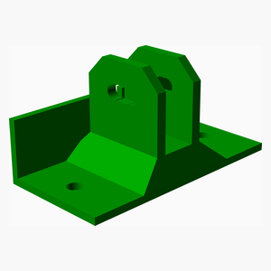
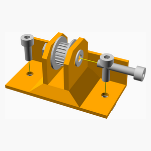
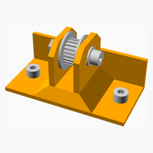
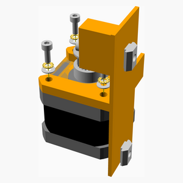
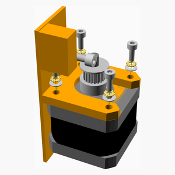
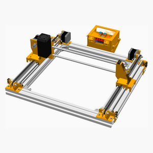

# Fisher Price CNC

---
## Table of Contents
1. [Parts list](#Parts_list)
1. [Y Idler Assembly](#y_idler_assembly)
1. [Y Motor Right Assembly](#y_motor_right_assembly)
1. [Y Motor Left Assembly](#y_motor_left_assembly)
1. [Y Axis Holder Assembly](#y_axis_holder_assembly)
1. [Y Rod Assembly](#y_rod_assembly)
1. [Frame Assembly](#frame_assembly)
1. [Main Assembly](#main_assembly)

[Top](#TOP)

---

## Parts list
| Y&nbsp;Idler | Y&nbsp;Motor&nbsp;Right | Y&nbsp;Motor&nbsp;Left | Y&nbsp;Axis&nbsp;Holder | Y&nbsp;Rod | Frame | Main | TOTALS |  |
|---:|---:|---:|---:|---:|---:|---:|---:|:---|
|  |  |  |  |  |  |  | | **Vitamins** |
| &nbsp;&nbsp;.&nbsp; | &nbsp;&nbsp;.&nbsp; | &nbsp;&nbsp;.&nbsp; | &nbsp;&nbsp;.&nbsp; | &nbsp;&nbsp;.&nbsp; | &nbsp;&nbsp;.&nbsp; | &nbsp;&nbsp;2&nbsp; |  &nbsp;&nbsp;2&nbsp; | &nbsp;&nbsp; Belt GT2 x 4mm x 780mm |
| &nbsp;&nbsp;.&nbsp; | &nbsp;&nbsp;.&nbsp; | &nbsp;&nbsp;.&nbsp; | &nbsp;&nbsp;.&nbsp; | &nbsp;&nbsp;.&nbsp; | &nbsp;&nbsp;2&nbsp; | &nbsp;&nbsp;.&nbsp; |  &nbsp;&nbsp;2&nbsp; | &nbsp;&nbsp; Extrusion E3030 x 435mm |
| &nbsp;&nbsp;.&nbsp; | &nbsp;&nbsp;.&nbsp; | &nbsp;&nbsp;.&nbsp; | &nbsp;&nbsp;.&nbsp; | &nbsp;&nbsp;.&nbsp; | &nbsp;&nbsp;2&nbsp; | &nbsp;&nbsp;.&nbsp; |  &nbsp;&nbsp;2&nbsp; | &nbsp;&nbsp; Extrusion E3060 x 335mm |
| &nbsp;&nbsp;.&nbsp; | &nbsp;&nbsp;.&nbsp; | &nbsp;&nbsp;.&nbsp; | &nbsp;&nbsp;.&nbsp; | &nbsp;&nbsp;.&nbsp; | &nbsp;&nbsp;4&nbsp; | &nbsp;&nbsp;.&nbsp; |  &nbsp;&nbsp;4&nbsp; | &nbsp;&nbsp; Extrusion corner bracket 20 |
| &nbsp;&nbsp;4&nbsp; | &nbsp;&nbsp;2&nbsp; | &nbsp;&nbsp;2&nbsp; | &nbsp;&nbsp;8&nbsp; | &nbsp;&nbsp;.&nbsp; | &nbsp;&nbsp;8&nbsp; | &nbsp;&nbsp;.&nbsp; |  &nbsp;&nbsp;24&nbsp; | &nbsp;&nbsp; Nut M4 sliding T |
| &nbsp;&nbsp;2&nbsp; | &nbsp;&nbsp;.&nbsp; | &nbsp;&nbsp;.&nbsp; | &nbsp;&nbsp;.&nbsp; | &nbsp;&nbsp;.&nbsp; | &nbsp;&nbsp;.&nbsp; | &nbsp;&nbsp;.&nbsp; |  &nbsp;&nbsp;2&nbsp; | &nbsp;&nbsp; Pulley MPMD Idler idler 14 teeth |
| &nbsp;&nbsp;.&nbsp; | &nbsp;&nbsp;1&nbsp; | &nbsp;&nbsp;1&nbsp; | &nbsp;&nbsp;.&nbsp; | &nbsp;&nbsp;.&nbsp; | &nbsp;&nbsp;.&nbsp; | &nbsp;&nbsp;.&nbsp; |  &nbsp;&nbsp;2&nbsp; | &nbsp;&nbsp; Pulley MPMD Pulley idler 14 teeth |
| &nbsp;&nbsp;2&nbsp; | &nbsp;&nbsp;.&nbsp; | &nbsp;&nbsp;.&nbsp; | &nbsp;&nbsp;.&nbsp; | &nbsp;&nbsp;.&nbsp; | &nbsp;&nbsp;.&nbsp; | &nbsp;&nbsp;.&nbsp; |  &nbsp;&nbsp;2&nbsp; | &nbsp;&nbsp; Screw M3 cap x  6mm |
| &nbsp;&nbsp;.&nbsp; | &nbsp;&nbsp;4&nbsp; | &nbsp;&nbsp;4&nbsp; | &nbsp;&nbsp;.&nbsp; | &nbsp;&nbsp;.&nbsp; | &nbsp;&nbsp;.&nbsp; | &nbsp;&nbsp;.&nbsp; |  &nbsp;&nbsp;8&nbsp; | &nbsp;&nbsp; Screw M3 cap x  8mm |
| &nbsp;&nbsp;.&nbsp; | &nbsp;&nbsp;.&nbsp; | &nbsp;&nbsp;.&nbsp; | &nbsp;&nbsp;.&nbsp; | &nbsp;&nbsp;.&nbsp; | &nbsp;&nbsp;8&nbsp; | &nbsp;&nbsp;.&nbsp; |  &nbsp;&nbsp;8&nbsp; | &nbsp;&nbsp; Screw M4 cap x  8mm |
| &nbsp;&nbsp;4&nbsp; | &nbsp;&nbsp;2&nbsp; | &nbsp;&nbsp;2&nbsp; | &nbsp;&nbsp;8&nbsp; | &nbsp;&nbsp;.&nbsp; | &nbsp;&nbsp;.&nbsp; | &nbsp;&nbsp;.&nbsp; |  &nbsp;&nbsp;16&nbsp; | &nbsp;&nbsp; Screw M4 cap x 10mm |
| &nbsp;&nbsp;.&nbsp; | &nbsp;&nbsp;.&nbsp; | &nbsp;&nbsp;.&nbsp; | &nbsp;&nbsp;8&nbsp; | &nbsp;&nbsp;.&nbsp; | &nbsp;&nbsp;.&nbsp; | &nbsp;&nbsp;.&nbsp; |  &nbsp;&nbsp;8&nbsp; | &nbsp;&nbsp; Smooth rod 8mm x 30mm |
| &nbsp;&nbsp;.&nbsp; | &nbsp;&nbsp;.&nbsp; | &nbsp;&nbsp;.&nbsp; | &nbsp;&nbsp;.&nbsp; | &nbsp;&nbsp;4&nbsp; | &nbsp;&nbsp;.&nbsp; | &nbsp;&nbsp;.&nbsp; |  &nbsp;&nbsp;4&nbsp; | &nbsp;&nbsp; Smooth rod 8mm x 335mm |
| &nbsp;&nbsp;.&nbsp; | &nbsp;&nbsp;1&nbsp; | &nbsp;&nbsp;1&nbsp; | &nbsp;&nbsp;.&nbsp; | &nbsp;&nbsp;.&nbsp; | &nbsp;&nbsp;.&nbsp; | &nbsp;&nbsp;.&nbsp; |  &nbsp;&nbsp;2&nbsp; | &nbsp;&nbsp; Stepper motor NEMA17 x 34mm |
| &nbsp;&nbsp;.&nbsp; | &nbsp;&nbsp;4&nbsp; | &nbsp;&nbsp;4&nbsp; | &nbsp;&nbsp;.&nbsp; | &nbsp;&nbsp;.&nbsp; | &nbsp;&nbsp;.&nbsp; | &nbsp;&nbsp;.&nbsp; |  &nbsp;&nbsp;8&nbsp; | &nbsp;&nbsp; Washer  M3 x 7mm x 0.5mm |
| &nbsp;&nbsp;.&nbsp; | &nbsp;&nbsp;.&nbsp; | &nbsp;&nbsp;.&nbsp; | &nbsp;&nbsp;.&nbsp; | &nbsp;&nbsp;.&nbsp; | &nbsp;&nbsp;8&nbsp; | &nbsp;&nbsp;.&nbsp; |  &nbsp;&nbsp;8&nbsp; | &nbsp;&nbsp; Washer  M4 x 9mm x 0.8mm |
| &nbsp;&nbsp;.&nbsp; | &nbsp;&nbsp;4&nbsp; | &nbsp;&nbsp;4&nbsp; | &nbsp;&nbsp;.&nbsp; | &nbsp;&nbsp;.&nbsp; | &nbsp;&nbsp;.&nbsp; | &nbsp;&nbsp;.&nbsp; |  &nbsp;&nbsp;8&nbsp; | &nbsp;&nbsp; Washer star M3 x 0.5mm |
| &nbsp;&nbsp;.&nbsp; | &nbsp;&nbsp;.&nbsp; | &nbsp;&nbsp;.&nbsp; | &nbsp;&nbsp;8&nbsp; | &nbsp;&nbsp;.&nbsp; | &nbsp;&nbsp;.&nbsp; | &nbsp;&nbsp;.&nbsp; |  &nbsp;&nbsp;8&nbsp; | &nbsp;&nbsp; Ziptie 2.5mm x 100mm min length |
| &nbsp;&nbsp;12&nbsp; | &nbsp;&nbsp;18&nbsp; | &nbsp;&nbsp;18&nbsp; | &nbsp;&nbsp;32&nbsp; | &nbsp;&nbsp;4&nbsp; | &nbsp;&nbsp;32&nbsp; | &nbsp;&nbsp;2&nbsp; | &nbsp;&nbsp;118&nbsp; | &nbsp;&nbsp;Total vitamins count |
|  |  |  |  |  |  |  | | **3D printed parts** |
| &nbsp;&nbsp;.&nbsp; | &nbsp;&nbsp;.&nbsp; | &nbsp;&nbsp;.&nbsp; | &nbsp;&nbsp;8&nbsp; | &nbsp;&nbsp;.&nbsp; | &nbsp;&nbsp;.&nbsp; | &nbsp;&nbsp;.&nbsp; |  &nbsp;&nbsp;8&nbsp; | &nbsp;&nbsp;y_axis_holder.stl |
| &nbsp;&nbsp;2&nbsp; | &nbsp;&nbsp;.&nbsp; | &nbsp;&nbsp;.&nbsp; | &nbsp;&nbsp;.&nbsp; | &nbsp;&nbsp;.&nbsp; | &nbsp;&nbsp;.&nbsp; | &nbsp;&nbsp;.&nbsp; |  &nbsp;&nbsp;2&nbsp; | &nbsp;&nbsp;y_idler.stl |
| &nbsp;&nbsp;.&nbsp; | &nbsp;&nbsp;.&nbsp; | &nbsp;&nbsp;1&nbsp; | &nbsp;&nbsp;.&nbsp; | &nbsp;&nbsp;.&nbsp; | &nbsp;&nbsp;.&nbsp; | &nbsp;&nbsp;.&nbsp; |  &nbsp;&nbsp;1&nbsp; | &nbsp;&nbsp;y_motor_left_mount.stl |
| &nbsp;&nbsp;.&nbsp; | &nbsp;&nbsp;1&nbsp; | &nbsp;&nbsp;.&nbsp; | &nbsp;&nbsp;.&nbsp; | &nbsp;&nbsp;.&nbsp; | &nbsp;&nbsp;.&nbsp; | &nbsp;&nbsp;.&nbsp; |  &nbsp;&nbsp;1&nbsp; | &nbsp;&nbsp;y_motor_right_mount.stl |
| &nbsp;&nbsp;2&nbsp; | &nbsp;&nbsp;1&nbsp; | &nbsp;&nbsp;1&nbsp; | &nbsp;&nbsp;8&nbsp; | &nbsp;&nbsp;.&nbsp; | &nbsp;&nbsp;.&nbsp; | &nbsp;&nbsp;.&nbsp; | &nbsp;&nbsp;12&nbsp; | &nbsp;&nbsp;Total 3D printed parts count |

[Top](#TOP)

---

## 2 x Y Idler Assembly
### Vitamins
|Qty|Description|
|---:|:----------|
|4| Nut M4 sliding T|
|2| Pulley MPMD Idler idler 14 teeth|
|2| Screw M3 cap x  6mm|
|4| Screw M4 cap x 10mm|

### 3D Printed parts

| 2 x y_idler.stl |
|---|
|  

### Assembly instructions

This part mounts the MPMD idler onto a bracket and aligns it with the motor pulley.
The MPMD idler is riveted into a metal bracket. You may need to cut the existing belt
as it will likely be attached to the idler already - don't worry, you will need an open
belt anyway.

First, affix the idler on its bracket to the printed part using an M3*6 screw. Then,
you can attach the sliding nuts loosely and slide it onto the extrusion. Keep aligned with the
edge of the extrusion. You can also use the whole part to adjust the tension of the belt.

[Top](#TOP)

---

## Y Motor Right Assembly
### Vitamins
|Qty|Description|
|---:|:----------|
|2| Nut M4 sliding T|
|1| Pulley MPMD Pulley idler 14 teeth|
|4| Screw M3 cap x  8mm|
|2| Screw M4 cap x 10mm|
|1| Stepper motor NEMA17 x 34mm|
|4| Washer  M3 x 7mm x 0.5mm|
|4| Washer star M3 x 0.5mm|

### 3D Printed parts

| 1 x y_motor_right_mount.stl |
|---|
|  

### Assembly instructions

Orient the motor so that the back is towards the hole closer to the edge
of the mounting plate, and that the cable comes out towards the rear of
the unit.

Use M3*8 screws to affix the motor to the holder part.

To mount to the frame, make sure that the motor shaft is pointing towards
the end of the extrusion. You could try to install the T-nuts loosely on
screws going through the mounting plate and then slide the whole module
onto the extrusion. Align the edge of the mounting plate with the edge of
the extrusion and tighten the M4 screws.

[Top](#TOP)

---

## Y Motor Left Assembly
### Vitamins
|Qty|Description|
|---:|:----------|
|2| Nut M4 sliding T|
|1| Pulley MPMD Pulley idler 14 teeth|
|4| Screw M3 cap x  8mm|
|2| Screw M4 cap x 10mm|
|1| Stepper motor NEMA17 x 34mm|
|4| Washer  M3 x 7mm x 0.5mm|
|4| Washer star M3 x 0.5mm|

### 3D Printed parts

| 1 x y_motor_left_mount.stl |
|---|
|  

### Assembly instructions

Orient the motor so that the back is towards the hole closer to the edge
of the mounting plate, and that the cable comes out towards the rear of
the unit.

Use M3*8 screws to affix the motor to the holder part.

To mount to the frame, make sure that the motor shaft is pointing towards
the end of the extrusion. You could try to install the T-nuts loosely on
screws going through the mounting plate and then slide the whole module
onto the extrusion. Align the edge of the mounting plate with the edge of
the extrusion and tighten the M4 screws.

[Top](#TOP)

---

## 8 x Y Axis Holder Assembly
### Vitamins
|Qty|Description|
|---:|:----------|
|8| Nut M4 sliding T|
|8| Screw M4 cap x 10mm|
|8| Smooth rod 8mm x 30mm|
|8| Ziptie 2.5mm x 100mm min length|

### 3D Printed parts

| 8 x y_axis_holder.stl |
|---|
|  

### Assembly instructions

There are 8 of these y-axis holders. For each of them, insert an M4 screw into the hole and
fasten a M4 T-nut at the bottom loosely. Don't tighten them too much as you will need to insert
the T-nut into the 3060 extrusion. Then you can tighten the screw, but make sure the alignment
works.

[Top](#TOP)

---

## 4 x Y Rod Assembly
### Vitamins
|Qty|Description|
|---:|:----------|
|4| Smooth rod 8mm x 335mm|

### Sub-assemblies

| 8 x y_axis_holder_assembly |
|---|
|  

### Assembly instructions

[Top](#TOP)

---

## Frame Assembly
### Vitamins
|Qty|Description|
|---:|:----------|
|2| Extrusion E3030 x 435mm|
|2| Extrusion E3060 x 335mm|
|4| Extrusion corner bracket 20|
|8| Nut M4 sliding T|
|8| Screw M4 cap x  8mm|
|8| Washer  M4 x 9mm x 0.8mm|

### Assembly instructions

[Top](#TOP)

---

## Main Assembly
### Vitamins
|Qty|Description|
|---:|:----------|
|2| Belt GT2 x 4mm x 780mm|

### Sub-assemblies

| 1 x frame_assembly | 2 x y_idler_assembly | 1 x y_motor_left_assembly |
|---|---|---|
|  |  |  

| 1 x y_motor_right_assembly | 4 x y_rod_assembly |
|---|---|
|  |  

### Assembly instructions

Assembles the CNC. ALL T-nuts must be inserted prior to assembling the
frame with the corner brackets.

[Top](#TOP)
